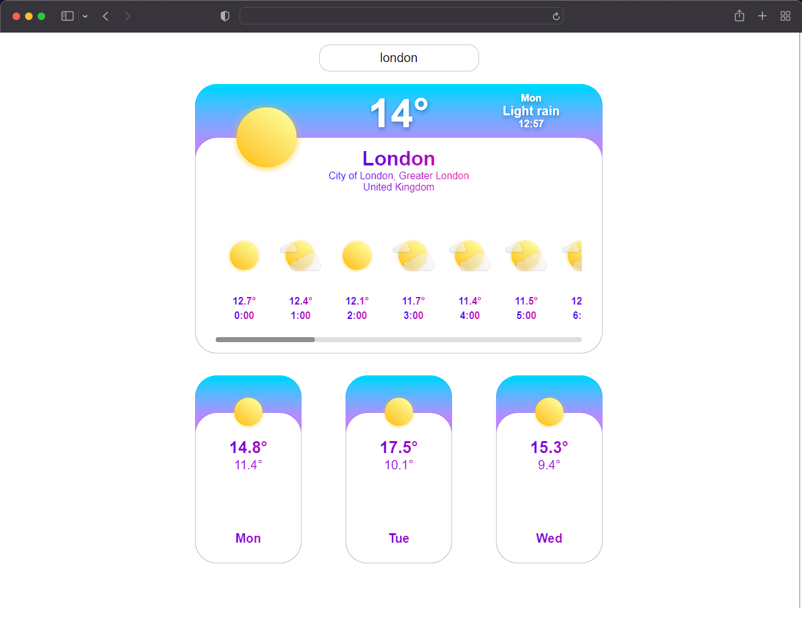
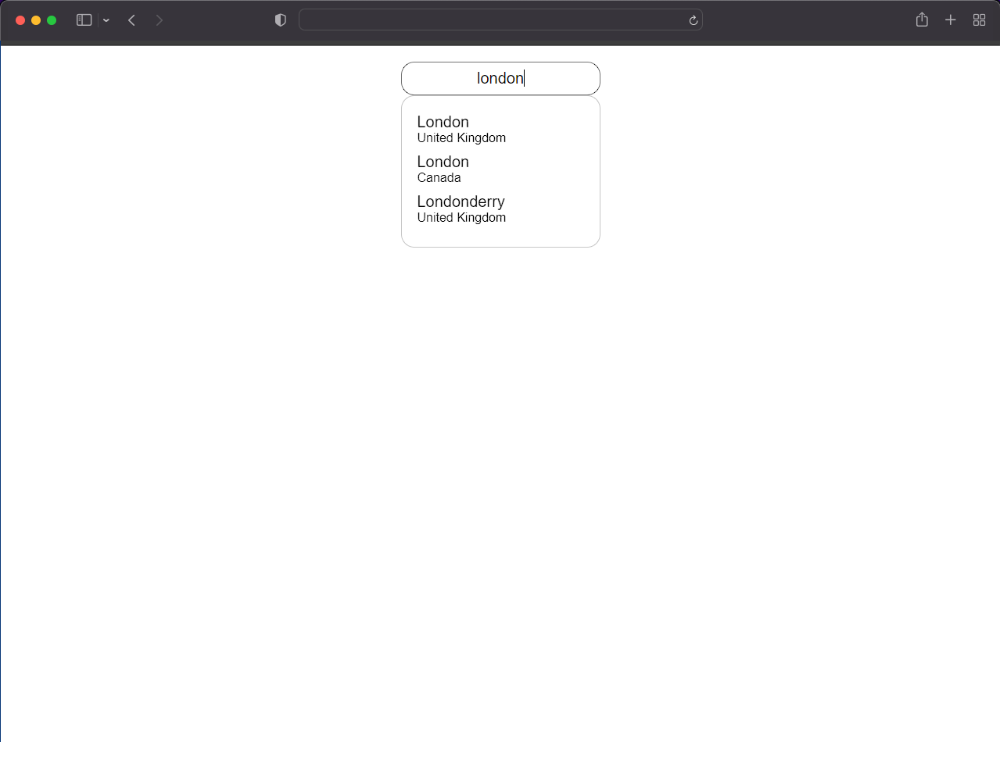

# Weather API
Aplicativo que motra a previsão do tempo de qualquer lugar do mundo.

### Funcionalidades
<ul>
  <li> O App mostra a previsão do tempo em até 2 dias no futuro. </ li>
  <li> O App mostra a temperatura atual do lugar escolhido. </ li>
  <li> O App mostra a temperatura pelo resto do dia separada em horas do lugar escolhido. </ li>
  <li> O App tem uma barra de pesquisa. </ li>
</ul>

### Tecnologias e ferramentas
<ul>
  <li> ReactJS </ li>
  <li> Fetch API </ li>
  <li> Styled-Components </ li>
</ul>

### App
Link para o <a href="https://weather-api-phi-three.vercel.app/"> App </a>.

 
